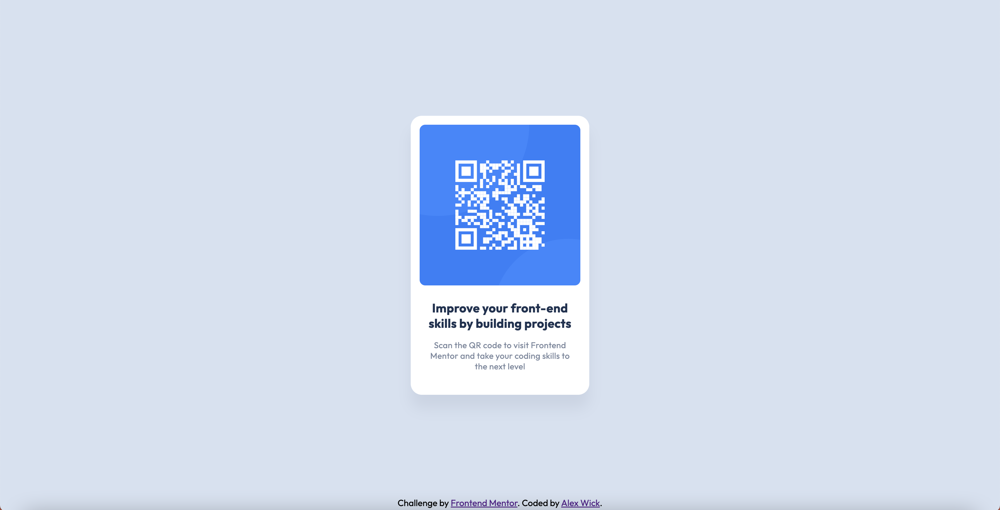

# Frontend Mentor - QR code component solution

This is a solution to the [QR code component challenge on Frontend Mentor](https://www.frontendmentor.io/challenges/qr-code-component-iux_sIO_H). Frontend Mentor challenges help you improve your coding skills by building realistic projects. 

## Table of contents

- [Overview](#overview)
  - [Screenshot](#screenshot)
  - [Links](#links)
- [My process](#my-process)
  - [Built with](#built-with)
  - [What I learned](#what-i-learned)
  - [Continued development](#continued-development)
  - [Useful resources](#useful-resources)
- [Author](#author)
- [Acknowledgments](#acknowledgments)

**Note: Delete this note and update the table of contents based on what sections you keep.**

## Overview

### Screenshot



### Links

- Solution URL: *WIP*
- Live Site URL: *WIP*

## My process

### Built with

- Semantic HTML5 markup
- CSS

### What I learned

I learned that I can center an element with a set width by setting its `position` to `absolute` and its `margin` to `auto`.

```css
#main-container {
  width: 320px;
  height: 500px;
  position: absolute;
  top: 0;
  bottom: 0;
  left: 0;
  right: 0;
  margin: auto;
}
```

I also learned how to use `box-shadow` and did so to add the subtle shadow below the main container.

```css
#main-container {
  box-shadow: 0px 25px 25px hsla(220, 15%, 55%, 15%);
}
```

### Continued development

I have not yet learned how to use CSS Gird Layout and CSS Flexbox Layout. I bet there are better ways that I could tackle this project using those tools.

### Useful resources

- [Resource 1](https://stackoverflow.com/questions/14123999/center-a-div-horizontally-and-vertically) - This StackOverflow thread helped me use `position` to center the main container.
- [Resource 2](https://developer.mozilla.org/en-US/docs/Web/CSS/box-shadow) - The Mozilla documentation helped me learn how to use `box-shadow`.

## Author

- Website - [Alex Wick](http://alexwick.co/)
- Frontend Mentor - [@alexjwick](https://www.frontendmentor.io/profile/alexjwick)

## Acknowledgments

Thank you to Nrc on StackOverflow for the idea of the solution to centering the main container.